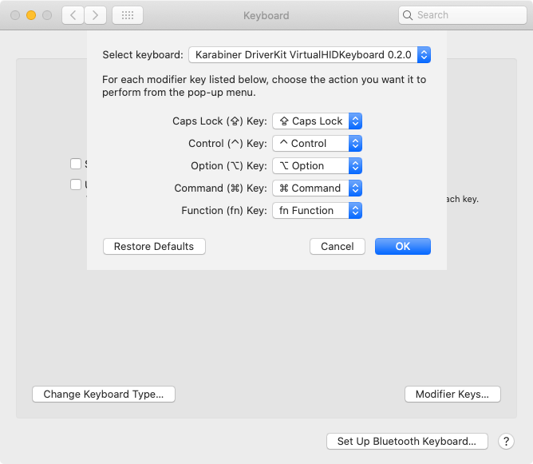
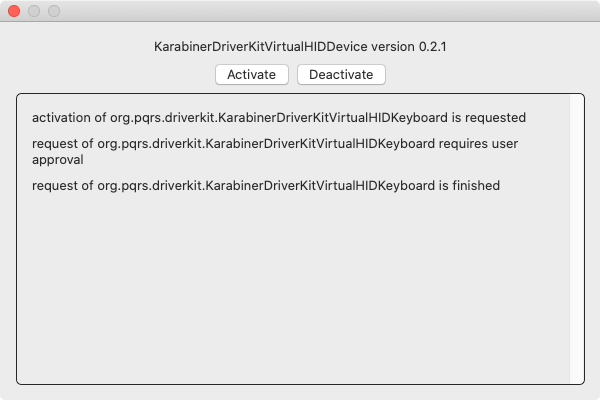

[](https://github.com/pqrs-org/Karabiner-DriverKit-VirtualHIDDevice/actions)
[](https://github.com/pqrs-org/Karabiner-DriverKit-VirtualHIDDevice/blob/master/LICENSE.md)

# Karabiner-DriverKit-VirtualHIDDevice

Virtual devices (keyboard and mouse) implementation for macOS using DriverKit.

## Status

-   Implemented:
    -   Extension manager
    -   Virtual HID keyboard
-   WIP:
    -   Virtual HID pointing

## Documents

-   [How to be close to DriverKit](DEVELOPMENT.md)
-   [Extracts from xnu](XNU.md)





---

## For developers

### How to build

System requirements to build Karabiner-Elements:

-   macOS 10.15+
-   Xcode 11+
-   Command Line Tools for Xcode
-   [XcodeGen](https://github.com/yonaskolb/XcodeGen)

### Steps

1.  Replace `CODE_SIGN_IDENTITY` at `src/scripts/codesign.sh` with yours.
    (The codesign identity is required even if you disabled SIP in order to inject entitlements into your driver extension.)

    Find your codesign identity by executing the following command in Terminal.

    ```shell
    security find-identity -p codesigning -v
    ```

    The result is as follows.

    ```text
    1) 8D660191481C98F5C56630847A6C39D95C166F22 "Developer ID Application: Fumihiko Takayama (G43BCU2T37)"
    2) 6B9AF0D3B3147A69C5E713773ADD9707CB3480D9 "Apple Development: Fumihiko Takayama (YVB3SM6ECS)"
    3) 637B86ED1C06AE99854E9F5A5DCE02DA58F2BBF4 "Mac Developer: Fumihiko Takayama (YVB3SM6ECS)"
    4) 987BC26C6474DF0C0AF8BEA797354873EC83DC96 "Apple Distribution: Fumihiko Takayama (G43BCU2T37)"
        4 valid identities found
    ```

    Choose one of them (e.g., `6B9AF0D3B3147A69C5E713773ADD9707CB3480D9`) and replace existing `CODE_SIGN_IDENTITY` with yours as follows.

    ```shell
    # Replace with your identity
    readonly CODE_SIGN_IDENTITY=6B9AF0D3B3147A69C5E713773ADD9707CB3480D9
    ```

2.  (Optional) Search `G43BCU2T37` and replace them with your team identifier if you want to test your driver with SIP enabled environments.

    ```shell
    git grep G43BCU2T37 src/
    ```

3.  (Optional) Search `org.pqrs` and `org_pqrs`, then replace them with your domain if you want to test your driver with SIP enabled environments.

    ```shell
    git grep org.pqrs src/
    git grep org_pqrs src/
    ```

4.  Build by the following command in terminal.

    ```shell
    cd src
    make
    ```

    `build/Release/KarabinerDriverKitVirtualHIDDevice.app` will be generated.
